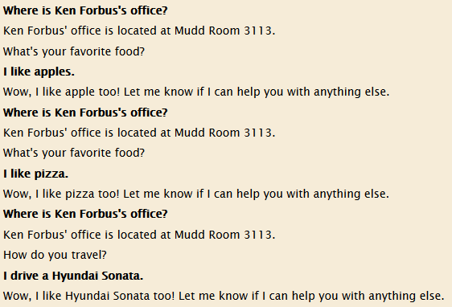
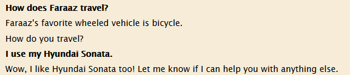

# User Ontologization Extension for Companions Kiosk

[Repository Link](https://github.com/swapnanildeb/EECS_396_conversational_interfaces)

This project was developed for Professor Ken Forbus's Conversational Interfaces Course at Northwestern University.
More information about the Companions system can be found at [the Qualitative Reasoning Group website](http://www.qrg.northwestern.edu/).

This project aims to add functionality to the Kiosk that allows it to "learn the user's preferences". At the moment, this includes a user's **favorite food** and their **preferred method of travel**. It also allows users to retrieve information stored in the knowledge base, provided that the target user is properly ontologized.

## User Preference Storage

The user's preferences are stored through answering a question asked by the Kiosk after it responds to a user's utterance. 
```
USER:  Where is Kenneth Forbus's office?

KIOSK: Ken Forbus's office is located at Mudd Room 3113.

KIOSK: What's your favorite food?

USER:  I like pizza.

KIOSK: Wow, I like pizza too! Let me know if I can help you with anything else.
```

This functionality can be tested by: 
1. Open a fresh instance of Companions in the Kiosk domain
2. In the 'Commands' tab, input the following: `(doForgetKBMt Interaction-Manager-KioskMt)`
3. Right-click the Session Reasoner agent and load the `task-models-kiosk.krf` and `user-info.krf` files.
4. In the 'Interaction' tab, type a message to the system. The message need not be an answerable question, but immersion increases greatly if it is.
5. When the Kiosk offers a question in response, answer with anything ontologized as a Food or WheeledTransportationDevice, depending on the question. Here is a list of known to-be-working answers:
   * What's your favorite food?
     - My favorite food is apples.
     - I like pizza.
     - I like apple pie!
   * How do you travel?
     - I ride a bicycle.
     - I drive a Hyundai Sonata.
     - I use a Ford Taurus.
6. \(Optional) Right-click the Session Reasoner agent, click Browse KB, then search for userInfo and click 'All References' on the left. Your answer should be tied to your Companions username in a SocialModeling microtheory uniquely to you.



## User Preference Retrieval

The desired user's preference is retrieved through asking a question, like so. 
```
USER:  How does Faraaz travel?

KIOSK: Faraaz's favorite wheeled vehicle is bicycle.

KIOSK: How do you travel?

USER:  I drive a Hyundai Sonata.

KIOSK: Wow, I like Hyundai Sonata too! Let me know if I can help you with anything else.
```

***If you would like to test this functionality using your results from the previous section, it is highly recommended that:***
- If you are already ontologized in the system (most NU faculty), please **change your Companions username to match the ontologization token** e.g. Professor Ken Forbus would change their username to `KenForbus`
- If you are not already ontologized, please use `user-info.krf` as a model to add your own ontologization to the knowledge base, either through the browser or through reloading the file.

***If you have done either of these steps, please retry the previous info storage section to make sure your preferences are correctly saved.***

This functionality can be tested by:
1. Open a fresh instance of Companions in the Kiosk domain
2. In the accompanying Allegro Lisp console, type one of the following commands. The former retains all original answerable questions while adding our own, while the latter contains only our functions, but is much faster to train.
   * `:ld <absolute_path_to_train-questions.lsp>`
   * `:ld <absolute_path_to_user-info-questions.lsp>`
3. In the lisp console, type `(forget-case-library *gen-ees-library*)`
4. In the lisp console, type one of the following. The first should be used if all training questions were included. The second should be used if only our questions were used for training.
   * `(run-training-set *full-question-set*)`
   * `(run-training-set *user-info-questions*)`
5. Ensure that the `task-models-kiosk.krf` and `user-info.krf` files are loaded in the Session Reasoner agent.
6. Ask the Kiosk about the food or travel preferences of a properly ontologized user. Here is a list of known to-be-working questions:
   * What is Faraaz's favorite food?
   * What food does Nate like to eat?
   * How does Swapnanil like to travel?
   * How does Annika travel?
   * What is Jakub's preferred method of travel?
7. The Kiosk will return the answer (and may potentially ask a follow-up question; the followup question may be ignored if you wish.



***

Additional screenshots of sample conversations can be found in the repository's images folder.
